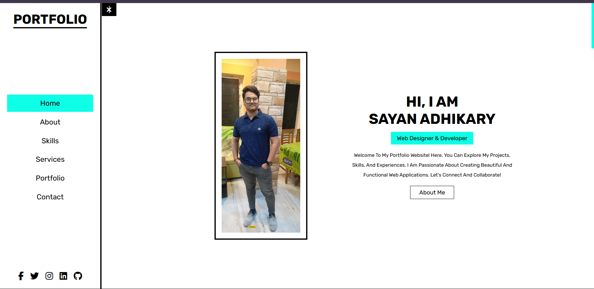
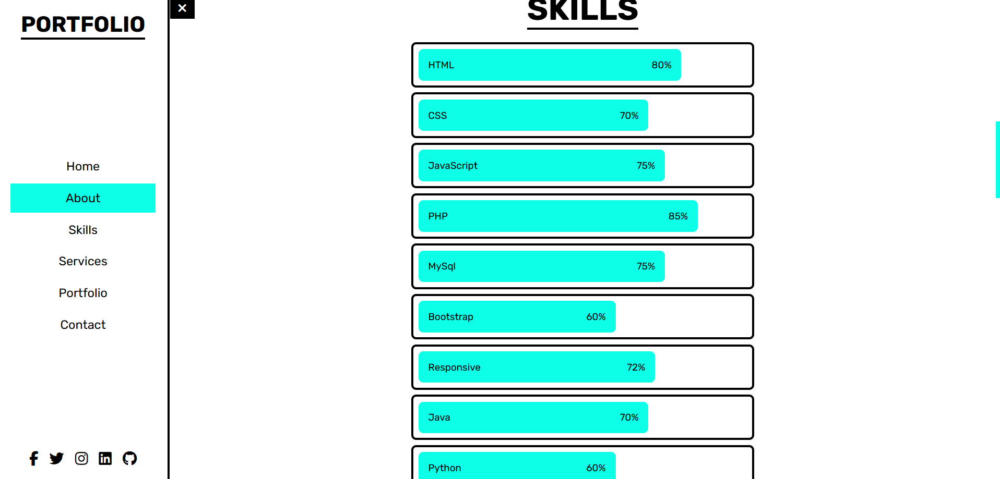
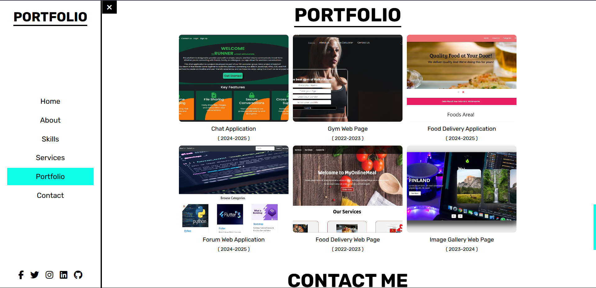
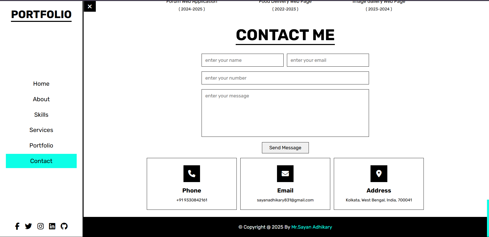

# 💼 Portfolio Website

This is a **Personal Portfolio Website** project built using **HTML, CSS, JavaScript, PHP, and MySQL**. The website showcases my biography, skills, education, work experience, projects, and a contact form with message handling and database storage.

## 🔗 Live Preview
[View Website](#) <!-- Replace # https://sayanadhikary.free.nf/ -->

---

## 📂 Features

- 🧑‍💼 Personal Introduction Section
- 🧾 Biography (Name, Email, Address, Age, Experience)
- 📚 Education & 💼 Experience Timeline
- 🛠️ Skills Progress Bar
- 🧰 Services Section
- 🖼️ Project Portfolio Gallery
- 📞 Contact Form (with PHP and MySQL integration)
- ✅ Message success alert after submission
- 🔐 Secure form input using PHP

---

## 💻 Technologies Used

| Technology  | Usage                          |
|-------------|--------------------------------|
| HTML        | Website structure              |
| CSS         | Styling and layout             |
| JavaScript  | Interactivity and UI effects   |
| PHP         | Backend logic and form handler |
| MySQL       | Contact form data storage      |
| Bootstrap   | Responsive design framework    |

---

## 📸 Screenshots
### 🧑‍💼 Home 
 

### 🧾 Biography
 

### 🛠️ Skills Progress Bar


### 📚 Education & Experience


### 💼 Portfolio Projects


### 📬 Contact Form


---

## 📁 Folder Structure


POTEFOLIO/
│
├── .vscode/ # VSCode workspace settings<br>
├── CSS/ # All stylesheet files<br>
├── CV/ # Resume/CV files (PDF/DOC)<br>
├── images/ # Images used in the website<br>
├── js/ # JavaScript functionality<br>
├── index.php # Main entry point of the site<br>
├── LICENSE # License file (MIT or others)<br>
└── README.md # Project documentation (this file)


🛠️ Setup Instructions

 1. Clone the repository  
   ```bash
   git clone https://github.com/yourusername/portfolio.git
   ```

2.Import the SQL table from phpMyAdmin

    Create a table named contacts (columns: id, name, email, number, message)
 3.Configure dbconnect.php with your database credentials

 4. Run index.php on localhost using XAMPP or WAMP


 📌 Contact Info Storage (MySQL)
    Sample schema for the contacts table:
---
## sql

```bash
## CREATE TABLE `contacts` 
    `id` int(11) NOT NULL AUTO_INCREMENT,
    `name` varchar(100) NOT NULL,
    `email` varchar(100) NOT NULL,
    `number` varchar(20) NOT NULL,
    `message` text NOT NULL,
    PRIMARY KEY (`id`)
   );
```

 🙋‍♂️ About Me
# I’m Sayan Adhikary, a passionate Web Designer & Developer from Kolkata, India.
   I love working on dynamic projects and web applications using modern technologies.

 📧 Contact
    📍 Location: Kolkata, West Bengal, India

   📱 Phone: +91 9330842161

    📧 Email: sayanadhikary831@gmail.com

 🏁 Future Improvements
    Add reCAPTCHA to the contact form

    Enable email notifications for new messages

    Add light/dark theme toggle

    Make the site multilingual

 📜 License
    This project is open-source and available under the MIT License.

    ---
    <a href="potefolio/LICENSE"></a>
    ---
 
